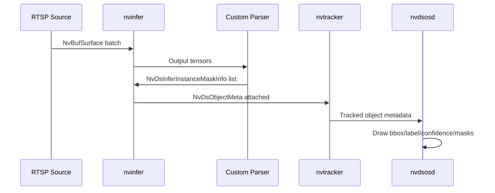

# DeepStream Pipeline Details

## Elements and Responsibilities

1. `rtspsrc`: pulls one or more RTSP streams.
2. `nvstreammux`: batches frames into one buffer.
3. `nvinfer`: executes YOLO11-Seg TensorRT engine.
4. `nvtracker`: maintains object identity over time.
5. `nvdsosd`: renders boxes, labels, confidence, and masks.
6. Encoder + RTSP sink: re-encodes and publishes output stream.

## Metadata Flow

